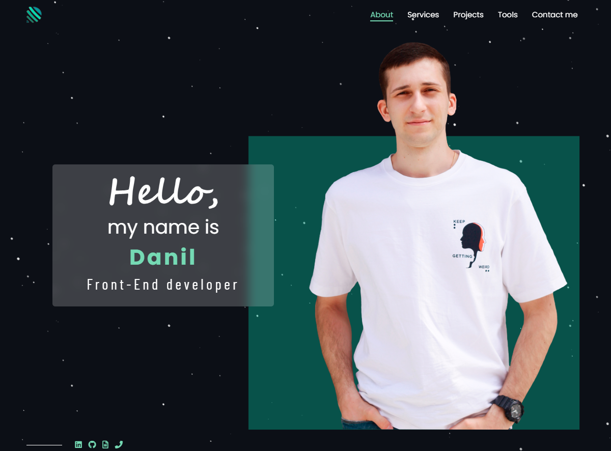
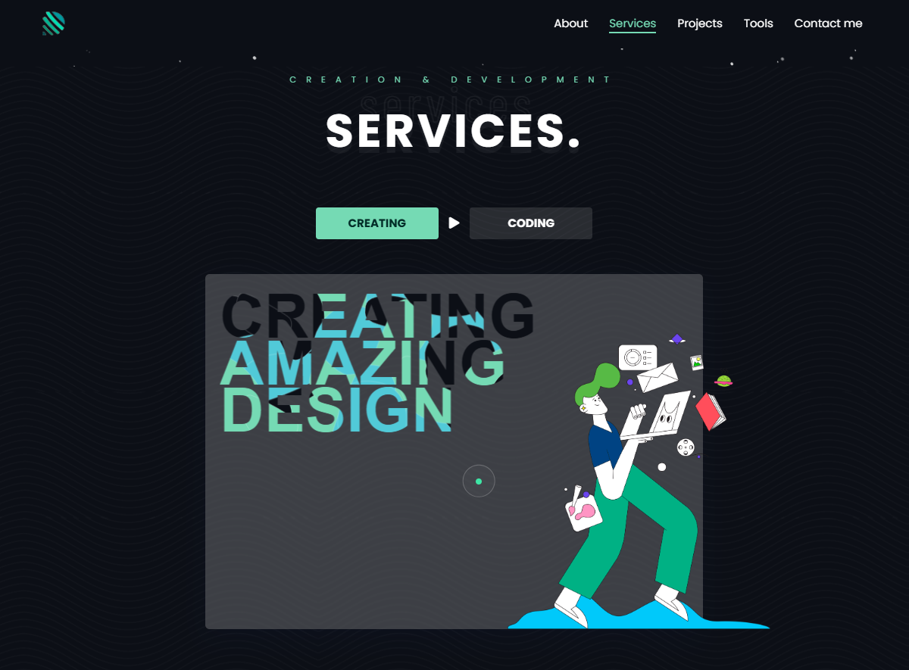
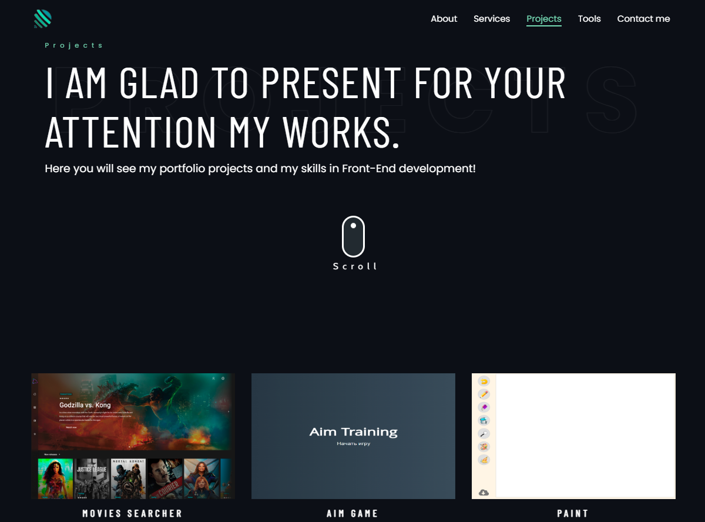
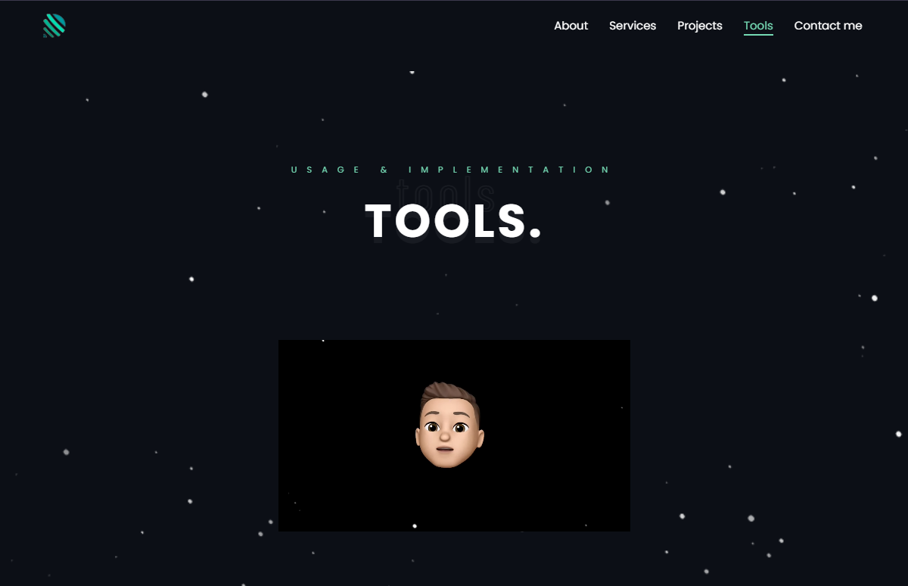
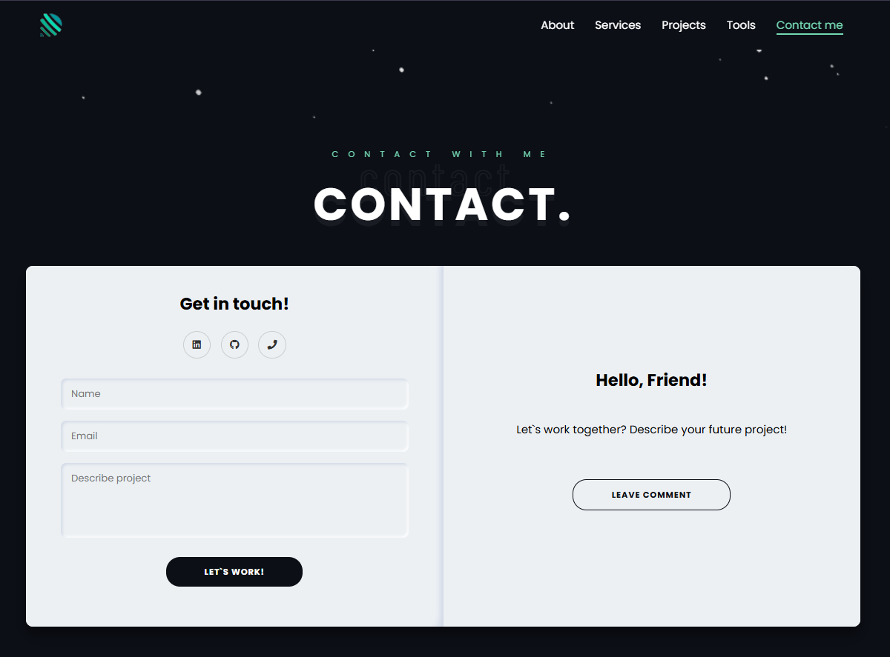

# My Portfolio Website

This is my personal portfolio website, created to showcase my skills, projects, and achievements.  
Live demo: [My Portfolio](https://my-portfolio-website-lovat.vercel.app).

## 🚀 Features

- Fully responsive design
- Smooth animations with GSAP
- Modular SCSS structure
- Optimized for performance

## 🛠️ Technologies

The website is built using the following technologies:

- **HTML** – page structure
- **SCSS** – styling and design
- **JavaScript** – interactivity and functionality
- **Gulp** – task automation for development
- **GSAP** – animations and smooth transitions

## 📂 Project Structure

Key directories and files in the project:

- `src/` – source files
- `dist/` – production build
- `gulp/` – Gulp tasks and configurations

## 📦 Installation & Usage

To run the project locally, follow these steps:

1. Clone the repository:

    ```sh
    git clone https://github.com/danilfomchik/My-portfolio-website.git
    cd My-portfolio-website

    ```

2. Install dependencies:
    ```sh
    npm install
    ```
3. Start the development server:
    ```sh
    npm run dev
    ```

## 📸 Screenshots
<details>
<summary>Screenshots</summary>
<br>






</details>

## 📜 License

This project is licensed under the **MIT License**.

Feel free to contribute or open issues if you find any bugs! 🚀
